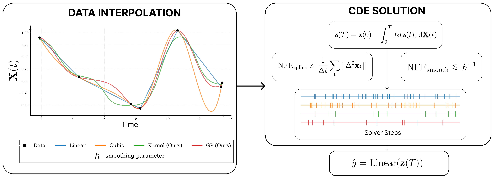
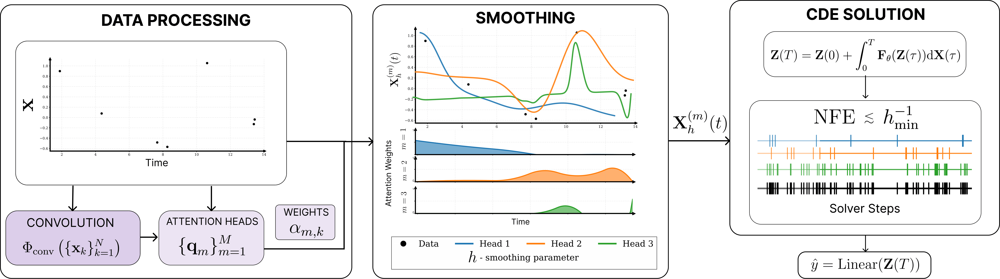
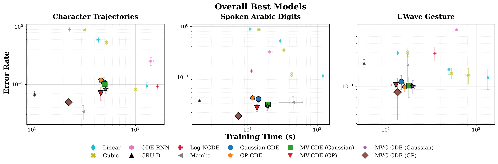
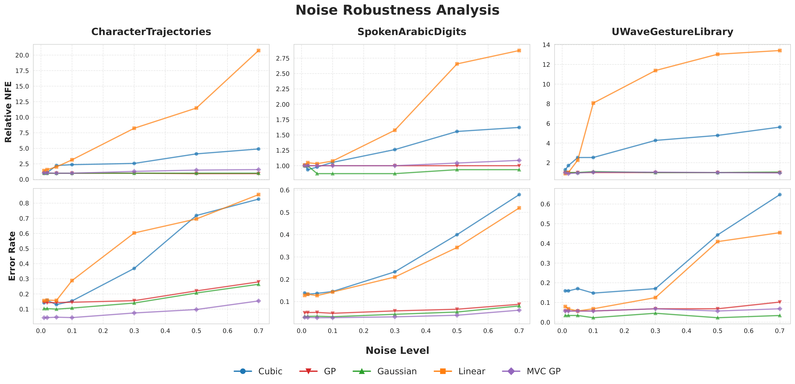
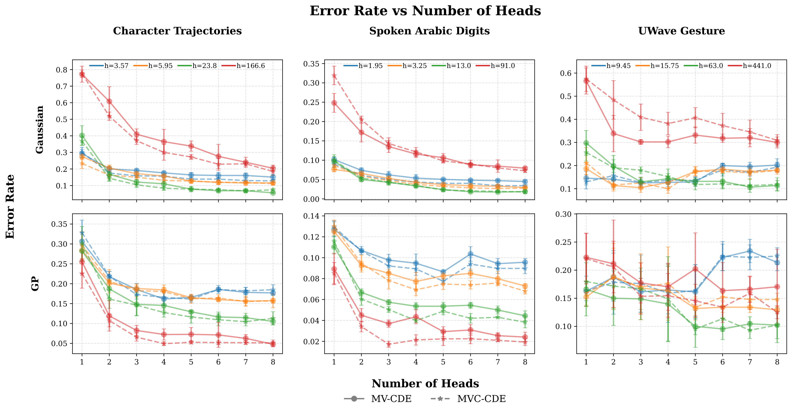
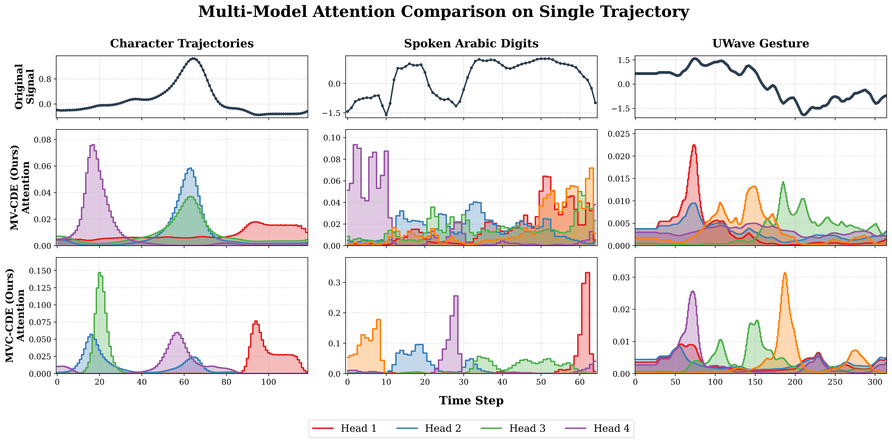

# Efficient Neural Controlled Differential Equations via Attentive Kernel Smoothing

[](https://openreview.net/forum?id=e6hVbhHEXh) 
[](#)

Official implementation of **Multi-View Neural Controlled Differential Equations (MV-CDE)** and **Convolutional Multi-View Neural Controlled Differential Equations (MVC-CDE)**.

## Abstract

Neural Controlled Differential Equations (Neural CDEs) provide a powerful continuous-time framework for sequence modeling, yet the roughness of the driving control path often restricts their efficiency. Standard splines introduce high-frequency variations that force adaptive solvers to take excessively small steps, driving up the Number of Function Evaluations (NFE). We propose a novel approach to Neural CDE path construction that replaces exact interpolation with Kernel and Gaussian Process (GP) smoothing, enabling explicit control over trajectory regularity. To recover details lost during smoothing, we propose an attention-based **Multi-View CDE (MV-CDE)** and its convolutional extension (**MVC-CDE**), which employ learnable queries to inform path reconstruction. This framework allows the model to distribute representational capacity across multiple trajectories, each capturing distinct temporal patterns. Empirical results demonstrate that our method, MVC-CDE with GP, achieves state-of-the-art accuracy while significantly reducing NFEs and total inference time compared to spline-based baselines.

---

## 1. Methodology Overview

### Standard Neural CDE vs. Smoothing
Standard CDEs rely on precise interpolation (e.g., cubic splines) which forces the solver to evaluate highly irregular paths, leading to integration bottlenecks. We decouple the integration cost from input noise via **Kernel and Gaussian Process (GP) smoothing**.

<p align="center">
  
  <br><em>Figure 1: Standard Neural CDE pipeline with highly irregular deterministic splines.</em>
</p>

### Multi-View Architecture (MV-CDE & MVC-CDE)
To counteract information loss induced by over-smoothing, we introduce an attention mechanism. The model learns to dynamically query and aggregate multiple smoothed versions of the trajectory, each capturing different temporal scales.

<p align="center">
  
  <br><em>Figure 2: Proposed MV-CDE and MVC-CDE architectures.</em>
</p>

---

## 2. Getting Started (Docker Environment)

We strictly use Docker to ensure that all dependencies (PyTorch, TorchCDE, PyTorch Lightning, etc.) are correctly configured with GPU support.

### Setup Instructions
1. **Clone the Repository**:
   ```bash
   git clone git@github.com:awesomeslayer/Efficient_NCE_via_Attentive_Kernel_Smoothing.git
   cd Efficient_NCE_via_Attentive_Kernel_Smoothing
   ```

2. **Configure Credentials**:
   Create a `credentials` file in the root directory to map your host user to the container:
   ```bash
   #!/bin/bash
   export DOCKER_USER_ID=$(id -u)
   export DOCKER_GROUP_ID=$(id -g)
   export DOCKER_NAME="neural-cde-lab"
   export CONTAINER_NAME="cde_container"
   ```

3. **Build and Launch**:
   ```bash
   chmod +x build.sh launch_container.sh run.sh
   ./build.sh
   ./launch_container.sh
   ```

---

## 3. Classification Tasks & Configuration (`config.yaml`)

Classification experiments are controlled via YAML configuration files located in `main/configs/`. 

### A. General Training & Irregularity
* `dataset_name`: Name of the dataset (e.g., `"SpokenArabicDigits"`, `"CharacterTrajectories"`, `"UWaveGestureLibrary"`).
* `test_drop_rates`: (Bool) Enables testing on synthetically generated missing data.
* `drop_rates`: (List of Float) Fractions of observations to drop (e.g., `[0.0, 0.3, 0.5]`).
* `regularization`: (Bool) Enables attention head diversity regularization (JSD/Cosine penalties).

### B. Experiment Toggles (`experiments_to_run`)
Enable specific baselines and our proposed models:
* `baseline`: Standard Neural CDE (Linear/Cubic).
* `kernel` / `gp`: Single smoothed CDEs.
* `qformer`: **MV-CDE** (Multi-View CDE).
* `conv`: **MVC-CDE** (Convolutional Multi-View CDE).
* `odernn` / `grud` / `log_ncde`: RNN/Signature-based continuous-time baselines.
* `mamba`: Continuous-time State Space Model (Mamba) baseline.

### C. Multi-View Specific Parameters
* `kernels`: Background smoothing kernel (e.g., `["gaussian", "gp"]`).
* `bandwidth_lists_same`: Creates multiple heads with the SAME bandwidth. Example: `[[1.4, 1.4, 1.4]]`.
* `bandwidth_lists_different`: Creates heads with different bandwidths (Multi-Scale). Example: `[[0.03, 0.1, 0.4, 1.4]]`.

### D. Executing Classification
Use the `run.sh` script to train, aggregate, and plot results automatically:

```bash
# 1. Train models (Example: UWaveGestureLibrary best settings)
./run.sh main 0 ./main/configs/uwave_best_main.yaml

# 2. Aggregate JSON results into CSV tables
./run.sh agg

# 3. Generate all Paper Visualizations
./run.sh plot
```

---

## 4. Time-Series Forecasting (PyTorch Lightning)

We extend our methodology to generative forecasting under missing data scenarios. To keep the main repository focused and lightweight, the forecasting pipeline and its specific dependencies are maintained in a dedicated `forecasting` branch. The architecture utilizes **RevIN** normalization and a linear forecasting head on top of the MVC-GP encoder.

### Switching to the Forecasting Branch
To access the code and run forecasting experiments, you must first switch to the corresponding branch:
```bash
git checkout forecasting
```

### Running Forecasting Experiments
Forecasting tasks (e.g., ETTm1) are managed via PyTorch Lightning and tracked via MLFlow. Data loading automatically supports simulating extreme missingness via the `irregularity_fraction` parameter.

We provide an automated bash script `forecasting_exps.sh` to run the baselines (GRU, Cubic Neural CDE) and our method (MVC GP) sequentially across multiple seeds.

```bash
# Usage: ./forecasting_exps.sh <dataset_name> <seed1> [seed2] ...
# Example: Run ETTm1 forecasting with 30% missing data (irregularity=0.7) on 3 seeds
chmod +x forecasting_exps.sh
./forecasting_exps.sh ETTm1 42 123 456
```

You can also run a single experiment manually via the entry point:
```bash
python run_forecasting.py \
    --csv_path data/ETTm1.csv \
    --model_type mvc \
    --interp_type gp \
    --irregularity_fraction 0.7 \
    --seed 42
```

To aggregate and view the MLFlow results as a Markdown table:
```bash
python -m forecasting.scripts.gen_table
```

## 5. Main Results & Paper Visualizations

Running `./run.sh plot` parses the aggregated CSVs and generates the exact plots used in the paper inside the `pictures/` directory.

### Pareto Efficiency (Accuracy vs. Time)
Our method (MVC-GP) consistently dominates the Pareto front, demonstrating up to **14.5x speedups** over spline-based Neural CDEs while achieving SOTA accuracy.
<p align="center"></p>

### Noise Robustness
Standard interpolations degrade rapidly under noise, leading to exploding NFE and error rates. Smoothing mechanisms inherently filter this noise, maintaining near-constant integration speeds.
<p align="center"></p>

### Ablation: Number of Attention Heads
Performance scales positively with the number of views/heads, recovering high-frequency information lost to global smoothing.
<p align="center"></p>

### Interpretability: Learned Attention Dynamics
Different models adapt their queries to the dataset properties. MVC-CDE (Convolutional) creates sharper, localized temporal activations compared to standard MV-CDE.
<p align="center"></p>

### Forecasting Results: Extreme Missingness (ETTm1)
*Task: 24-step forecasting horizon with **30% random daily observation drops**.*

| Model | MSE $\downarrow$ | Training Time (s) $\downarrow$ |
| :--- | :--- | :--- |
| GRU | $0.476 \pm 0.007$ | **$33 \pm 3$** |
| Neural CDE (Cubic) | $0.487 \pm 0.004$ | $625 \pm 18$ |
| **MVC GP (Ours)** | **$0.428 \pm 0.009$** | $248 \pm 25$ |

---

### Extended Analysis and Ablation Studies
Due to space constraints in the main text, several comprehensive ablation studies are provided in **Appendix C** of our paper. These include:
* **High-dimensional scalability:** Evaluations on the 963-dimensional PEMS-SF dataset.
* **Robustness to high irregular sampling rates:** Tested on the Speech Commands dataset (up to 50% drops).
* **Impact of different adaptive solver orders:** Analysis using `bosh3`, `dopri5`, and `dopri8` integrators.
* **Head diversity regularization:** JSD and Cosine similarity penalties for multi-view queries.
* **Comparisons with traditional smoothing splines:** Validating the necessity of task-aware dynamic representations.

---

## 6. Model Architecture Mapping (Code vs. Paper)

| Configuration Key | Architecture Name in Paper | Smoothing Method | Reconstruction Mechanism |
| :--- | :--- | :--- | :--- |
| `baseline` | Neural CDE | Cubic/Linear Spline | None (Exact) |
| `kernel` | Smoothed CDE | Single Kernel | None |
| `gp` | GP-CDE | Gaussian Process | None |
| `qformer` | **MV-CDE** | Multi-View Kernel/GP | **Attention** |
| `conv` | **MVC-CDE** | Multi-View Kernel/GP | **Convolutional Attention** |
| `mamba` | Mamba | None | State Space Model |

---

## Citation

If you find this work or code helpful in your research, please consider citing our ICML 2026 paper:

```bibtex
@inproceedings{
anonymous2026efficient,
title={Efficient Neural Controlled Differential Equations via Attentive Kernel Smoothing},
author={Anonymous},
booktitle={Forty-third International Conference on Machine Learning},
year={2026},
url={https://openreview.net/forum?id=e6hVbhHEXh}
}
```